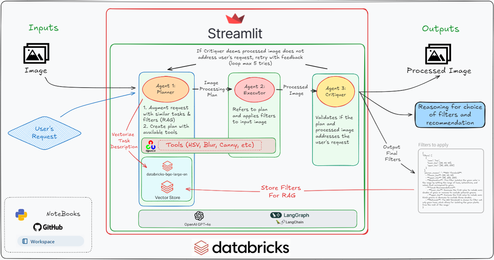

# GLB-Databricks-WC-2024
## AdaptiveFilters: Image Processing Agent

The next wave of innovation in agricultural biotechnology, poised to significantly impact sustainable agriculture, is the identification of novel biocontrol agents. GreenLight Biosciences is leading this charge with its pioneering bioinsecticide, Calantha. By identifying new biocontrol agents, farmers gain sustainable options for managing pests [[1](#reference-1)] while reducing reliance on chemical pesticides that can harm the environment and linger on food [[2](#reference-2)].

**Development Challenges**

The process of developing biocontrol agents is lengthy, involving laboratory testing, greenhouse evaluations, and field validation. This slow pipeline can hinder the timely introduction of effective solutions. However, the advent of Generative AI (GenAI) offers opportunities to automate and expedite biocontrol agent screening.

**Current Limitations**

AgBiotech companies utilize advanced image processing to assess prospective biocontrol agents, but establishing mature workflows requires significant investment and expertise. *This often leads to backlogs of unprocessed images and forces scientists without image processing knowledge to manually analyze data, consuming valuable research time.*

**Our Solution: AdaptiveFilters**

To address these challenges, we propose the AdaptiveFilters: Image Processing Agent. This solution leverages GenAI to allow users to efficiently create image processing pipelines. Users simply provide an image and a task description, and AdaptiveFilters returns a processed image along with recommended filters and the rationale for each choice.

| **End User Benefits**                                                                                   | **Technical User Benefits**                                                                             |
|---------------------------------------------------------------------------------------------------------|---------------------------------------------------------------------------------------------------------|
| - Saves time with intelligent filter recommendations over manual image processing.                     | - Image processing tasks can be delegated to the AdaptiveFilters app to streamline workflows.          |
| - Provides filter rationale and parameter optimization guidance.                                        | - Serves as a platform for deploying proprietary filters to end users.                                 |
| - Promotes the development of explainable AI applications.                                             | - AdaptiveFilters can act as a foundation for developing formal image processing pipelines.            |

## AdaptiveFilters Demonstration

[Watch a quick demo of AdaptiveFilters in action.](https://youtu.be/Fx4fqun9lQo?si=aYF-4L3FwF2ZJjwn)

## System Architecture

## References
**[1]** [Nchu, F. (2024). Sustainable biological control of pests: The way forward. Applied Sciences, 14(7), 2669](https://doi.org/10.3390/app14072669)

**[2]** [Góngora CE, Silva MdC. Sustainable Strategies for the Control of Crop Diseases and Pests to Reduce Pesticides. Agronomy. 2024; 14(9):2158](https://doi.org/10.3390/agronomy14092158)

